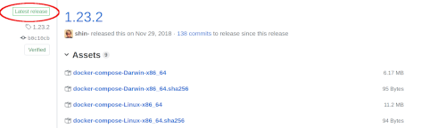

## Install Docker Compose
1. Browse to docker compose [release page](https://github.com/docker/compose/releases/ "Docker compose release page") on github and find the latest release (Like in the image below)


1. Download docker compose bin files
```bash
$ CURRENT_COMPOSE_RELEASE=1.23.2
$ sudo curl -L "https://github.com/docker/compose/releases/download/${CURRENT_COMPOSE_RELEASE}/docker-compose-$(uname -s)-$(uname -m)" -o /usr/local/bin/docker-compose
$ sudo chmod +x /usr/local/bin/docker-compose
```
1. Verify your installation
```bash
$ docker-compose --version
```